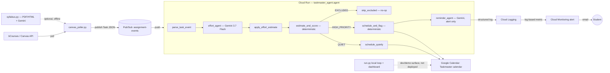

# Taskmaster — an ambient agent for the "five-tab tax"

**Google "All Things Agentic" hackathon — Taskmaster track.**

## Problem

A student juggling four classes checks Canvas, a course website, a syllabus
PDF, and their own calendar just to answer "what do I need to start today?"
None of those sources agree, most assignments never make it onto a real
calendar, and a newly posted project competes for the same evening as
whatever social plan got added last. That's real, observed friction, not
a hypothetical: across active Fall 2026 courses we found assignments that
live only in Canvas's structured API, others that exist only as prose in a
syllabus PDF, and at least one course whose "calendar" is a stale public ICS
feed with no current-term events at all. A single wrapper around one API
call doesn't cover this — it needs an agent that notices a change, decides
what it means, and acts.

## Solution

Taskmaster watches for new or changed Canvas assignments, has Gemini
estimate how much effort each one will take, scores urgency and grade
weight deterministically, and — without being asked — puts a work block on
a dedicated Google Calendar before the deadline. High-priority tasks also
get an escalating reminder. Re-running the sync updates existing blocks
instead of duplicating them, so the same pipeline that runs once for a demo
is the one that would run every hour for real.

```
new/changed assignment → Gemini effort estimate → deterministic priority score
    → real Google Calendar write (idempotent) → reminder alert if high-priority
```

## Architecture



Two surfaces show the same work: the deployed Cloud Run service is what
Pub/Sub, Gemini, and Cloud Logging actually touch (the cloud proof); the
local dashboard (`index.html`, `run.py`) reads the same Calendar and Canvas
data for a readable demo view. They are not the same process — see
[One scheduling brain, two triggers](#one-scheduling-brain-two-triggers)
below.

Scheduling is deterministic code in both the QUIET and HIGH_PRIORITY
routes (`schedule_quietly`, `schedule_and_flag`) — `reminder_agent`'s only
job is composing the alert. An earlier version asked one LLM call to both
schedule the block *and* emit the alert; in practice it sometimes only did
one of the two. Splitting them out fixed that and matches this file's own
principle: consequential actions belong in code, not LLM memory.

## Why the LLM only estimates effort

Gemini never decides what's urgent or what gets scheduled first —
`scoring.py`'s `score_task()` does that with a fixed formula
(`urgency × grade_weight × effort`), so the ranking is transparent,
debuggable, and can't be hallucinated. The one thing a deterministic
formula can't do from raw text is guess how long "Project 2: implement a
hash map" will take — that's the only judgment call handed to Gemini
(`prompts.py:EFFORT_ESTIMATOR_INSTRUCTION`), and its output is clamped to a
plausible range before it ever reaches the calendar (see below).

## Reliability: one visible failure/recovery path

- **LLM effort estimate is clamped, not trusted.** Gemini can return `0.01h`
  or `400h` for an estimate. `agent.py:apply_effort_estimate` clamps to
  `[0.25, 20]` hours, forces `confidence="low"` when it had to intervene,
  and logs the clamp so an operator can see it happened
  (`{"message": "Effort estimate was out of range and was clamped."}`).
- **Idempotent Calendar writes.** Every event is stamped with
  `extendedProperties.private.source_ref`. Re-processing the same
  assignment patches the existing block instead of inserting a duplicate
  (`calendar_tool.py:schedule_block`) — safe for retries and for an hourly
  Cloud Scheduler sync.
- **Pub/Sub retry + dead-letter.** `terraform/pubsub.tf` retries failed
  deliveries with exponential backoff and routes anything that fails 5
  times to a dead-letter topic, instead of silently dropping it.

## One scheduling brain, two triggers

`taskmaster_agent/calendar_tool.py` (called from the ADK graph, deployed on
Cloud Run) and `taskmaster_agent/taskmaster_calendar.py` (called from the local
`run.py` loop) share the *exact same* placement algorithm —
`taskmaster_calendar._plan_blocks_for_task` — not a simplified copy of it.
Effort padding, syllabus difficulty multipliers, grade weight, lead-time
pacing, multi-block splitting, and the daily-hour cap all apply on both
paths identically. Each block is [0.5, 3] hours; a task gets at most 3
blocks (so at most 9 hours of any one assignment is ever scheduled) —
whatever doesn't fit is reported as unscheduled rather than spread across
an unbounded string of sessions.

The two callers differ only in how they know what capacity is already
spoken for on a given day:

- `taskmaster_calendar.py`'s local batch scheduler sees every task in one
  run and shares a plain in-memory dict across all of them.
- `calendar_tool.py` is triggered one task at a time via Pub/Sub, with no
  batch to share state through — so it asks the live calendar itself how
  many agent-created hours are already on a given day
  (`_LiveDayCapacity`), getting the same answer a different way.

`calendar_tool.py` additionally checks the student's real `primary`
calendar for conflicts (`freebusy`) before accepting a slot — the local
batch scheduler has never done this, and still doesn't; that's an
intentional, additive difference, not something lost in translation.

Because one task can now need several blocks, and that number can change
between runs (a bigger or smaller effort re-estimate, more or less budget
left before the deadline), each block is stamped with `source_ref` +
`block_index`; re-processing a task patches its existing blocks, inserts
any new ones it now needs, and deletes any it no longer needs.

**Where blocks land is a config choice, not two competing files.**
`taskmaster_config.json`'s `calendar_target` (set via `onboarding.py`) is
either `"taskmaster"` (a new dedicated calendar — default) or `"primary"`
(the student's real calendar). Only `calendar_tool.py` honors it:

- It only ever inserts or patches the one event it owns
  (`source_ref`-keyed), never anything else, so writing to `primary` is
  safe there.
- `taskmaster_calendar.py`'s local scheduler **always** uses the dedicated
  calendar regardless of this setting, because it wipes and rebuilds its
  calendar's entire future on every run — doing that against `primary`
  would delete real events.

Either way, the free-slot search checks `primary`'s real busy times (plus
the target calendar's own, if different), so a newly added personal event
is a real conflict the agent reacts to — not just its own prior blocks.

## Repository layout

```
taskmaster_agent/
  agent.py              ADK graph: parse → Gemini effort estimate → score → route
  calendar_tool.py       The graph's consequential action: idempotent Calendar write
  scoring.py             Deterministic priority formula (the ranking judges can audit)
  prompts.py              The one LLM instruction in the whole pipeline
  models.py               Task, the normalized unit that flows through everything
  canvas_poller.py        Canvas → Pub/Sub bridge (real bCourses REST calls)
  syllabus.py              Syllabus PDF/HTML → Gemini difficulty + assignment extraction
  taskmaster_calendar.py   Local capacity-aware scheduler + dashboard data
  daily_view.py, task_list.py, study_plan.py, materials.py   Dashboard/briefing outputs
  onboarding.py            Terminal survey → taskmaster_config.json (per-student tuning)
  fast_api_app.py          ADK web server entrypoint (Cloud Run)
  run.py                   Local dev loop: refresh + serve the dashboard
terraform/                 Cloud Run, Pub/Sub, IAM, Cloud Monitoring
tests/test_integration.py  ADK graph tests (real Gemini calls, faked Calendar)
docs/setup_guide.md         Credential + GCP setup, step by step
docs/devlog.md               Before/decision/after log of the build
index.html                   Static dashboard, reads daily_view.json/task_list.json
```

## Setup

**Local:**

```sh
make install
cp .env.example .env   # add GOOGLE_API_KEY, or configure Vertex AI (see .env.example)
make dev               # runs the ADK graph + Pub/Sub trigger endpoint locally
```

Feed it real assignments from your own Canvas account (needs `CANVAS_TOKEN`,
see `docs/setup_guide.md` §1):

```sh
uv run python -m taskmaster_agent.feed_canvas
```

**Cloud deployment** — full credential and GCP setup in
[`docs/setup_guide.md`](docs/setup_guide.md); once the Calendar token secret
exists:

```sh
gcloud config set project YOUR_PROJECT_ID
make deploy NOTIFICATION_EMAIL=you@example.com
make remote-test   # publishes one sample assignment to the deployed agent
```

**Tests:**

```sh
make test
```

## What's real vs. what's a demo convenience

- **Real:** Canvas assignment data (`canvas_poller.py` hits the live bCourses
  REST API), Google Calendar writes (a real, dedicated "Taskmaster"
  calendar in the student's own account), Gemini effort estimation, and the
  deployed Cloud Run + Pub/Sub + Cloud Monitoring pipeline.
- **Demo convenience:** the local dashboard (`index.html`) is a static page
  reading JSON files written by `run.py`'s local loop — it is not itself
  deployed to Cloud Run. Cloud Run's own service account is what runs the
  autonomous Pub/Sub-triggered path; the local loop is a separate,
  authenticated-as-you convenience for a demo view of the same calendar.

## Tech stack

Gemini 3.7 Flash (via the Google ADK's `Agent`), Google ADK 2.0's
graph-based `Workflow`, Cloud Run, Pub/Sub (with dead-letter + retry),
Cloud Monitoring (log-based metric + email alert), Secret Manager (Calendar
OAuth token), and the Google Calendar API.
